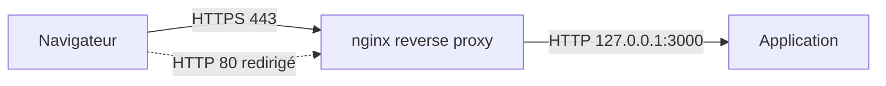

# Lab web : reverse proxy nginx avec HTTPS

> **Statut : à réaliser.** Ce guide est préparé à partir de la documentation officielle et de mes cours ; **je ne l'ai pas encore rejoué de bout en bout**. Les commandes sont à valider en le faisant, et le journal en bas de page sera complété avec mes résultats réels (captures, erreurs rencontrées, corrections).
>
> **Commandes vérifiées :** ce guide a été rejoué dans des conteneurs Debian 12 et 13 (22 septembre 2026), avec un vrai nginx et des certificats émis par [pki-interne-openssl](https://github.com/mehdiseg/pki-interne-openssl) : `nginx -t` valide la configuration, la redirection HTTP vers HTTPS répond bien 301, la connexion HTTPS avec la CA interne répond 200 et affiche le contenu de l'application derrière le proxy, les trois en-têtes de sécurité sont présents, la limite de débit sur `/connexion` déclenche des réponses 503 après quelques requêtes, et une machine sans la CA installée voit sa connexion refusée. Vérifié ne veut pas dire réalisé : c'est l'assistant IA qui a préparé ce guide qui a rejoué ces commandes dans un conteneur jetable, pas moi sur mon propre lab. Le journal ci-dessous reste à remplir une fois que je l'aurai fait moi-même.

## Objectif

Placer **nginx en reverse proxy** devant une application interne : nginx reçoit les connexions **HTTPS**, gère le certificat, ajoute des en-têtes de sécurité et limite le débit, puis transmet les requêtes à l'application qui, elle, n'écoute qu'en local.

Ce lab s'appuie sur une autorité interne créée avec [pki-interne-openssl](https://github.com/mehdiseg/pki-interne-openssl).

## Prérequis

- Une VM **Debian 12** avec nginx, et une application quelconque sur `127.0.0.1:3000` (par exemple `python3 -m http.server 3000 --bind 127.0.0.1`).
- Un certificat pour `wiki.lab` et sa chaîne (`wiki.lab.chaine.pem`), avec la clé `wiki.lab.key`.
- Sur le poste client : la CA installée, et `wiki.lab` résolu (fichier `hosts` ou DNS : voir [lab-dhcp-dns-debian](https://github.com/mehdiseg/lab-dhcp-dns-debian)).

## Topologie



## Étapes

### 1. Installer nginx et déposer le certificat

```bash
sudo apt update && sudo apt install -y nginx
sudo install -d -m 755 /etc/nginx/tls
sudo install -m 644 wiki.lab.chaine.pem /etc/nginx/tls/
sudo install -m 600 wiki.lab.key /etc/nginx/tls/          # la clé privée reste lisible par root seul
```

### 2. Configurer le site

Créer `/etc/nginx/sites-available/wiki.lab` :

Fichier du dépôt : [`configs/wiki.lab.conf`](configs/wiki.lab.conf)

```nginx
# Limite les tentatives sur une zone sensible : 5 requêtes par minute et par adresse
limit_req_zone $binary_remote_addr zone=connexion:10m rate=5r/m;

server {
    listen 80;
    server_name wiki.lab;
    return 301 https://$host$request_uri;
}

server {
    listen 443 ssl;
    server_name wiki.lab;

    ssl_certificate     /etc/nginx/tls/wiki.lab.chaine.pem;
    ssl_certificate_key /etc/nginx/tls/wiki.lab.key;
    ssl_protocols       TLSv1.2 TLSv1.3;

    add_header Strict-Transport-Security "max-age=31536000" always;
    add_header X-Content-Type-Options "nosniff" always;
    add_header X-Frame-Options "DENY" always;

    location / {
        proxy_pass http://127.0.0.1:3000;
        proxy_set_header Host              $host;
        proxy_set_header X-Real-IP         $remote_addr;
        proxy_set_header X-Forwarded-For   $proxy_add_x_forwarded_for;
        proxy_set_header X-Forwarded-Proto $scheme;
    }

    location /connexion {
        limit_req zone=connexion burst=3 nodelay;
        proxy_pass http://127.0.0.1:3000;
        proxy_set_header Host              $host;
        proxy_set_header X-Forwarded-For   $proxy_add_x_forwarded_for;
        proxy_set_header X-Forwarded-Proto $scheme;
    }
}
```

HTTP/2 s'active avec `http2 on;` (nginx 1.25.1 et plus) ou `listen 443 ssl http2;` sur les versions plus anciennes : à adapter selon la version installée (`nginx -v`).

### 3. Activer et recharger

```bash
sudo ln -s /etc/nginx/sites-available/wiki.lab /etc/nginx/sites-enabled/
sudo nginx -t                    # vérifie la syntaxe : toujours avant un rechargement
sudo systemctl reload nginx
```

L'application doit ensuite **ne plus être joignable directement** depuis le réseau : elle écoute sur `127.0.0.1` uniquement, et le pare-feu n'ouvre que 80 et 443.

## Vérifications

```bash
curl -I http://wiki.lab                                   # 301 vers https://wiki.lab/
curl --cacert ca.crt -I https://wiki.lab                  # 200, avec les en-têtes ajoutés (Strict-Transport-Security...)
openssl s_client -connect wiki.lab:443 -servername wiki.lab -CAfile ca.crt </dev/null | grep -E "Verify return|Protocol"
for i in $(seq 1 10); do curl -s -o /dev/null -w "%{http_code}\n" --cacert ca.crt https://wiki.lab/connexion; done   # des 503 apparaissent après quelques essais : limite de débit
curl -m 3 http://192.168.50.10:3000                       # doit échouer depuis un autre poste : l'application n'est pas exposée
```

## Pièges fréquents

- `nginx -t` oublié : un rechargement avec une erreur laisse l'ancienne configuration, ou pire, empêche un redémarrage.
- Chaîne de certificats incomplète (certificat sans l'autorité) : certains clients refusent la connexion.
- Le nom demandé (`wiki.lab`) n'est pas dans le SAN du certificat : le navigateur affiche une erreur.
- L'application se fie à `X-Forwarded-For` de n'importe qui : elle ne doit l'accepter **que** de son proxy de confiance.
- Application encore joignable directement sur son port depuis le réseau.

## Pour aller plus loin

- Répartir la charge sur plusieurs applications avec un bloc `upstream`.
- Obtenir un certificat public automatiquement avec Let's Encrypt (`certbot --nginx`) pour un vrai nom de domaine.
- Ajouter une authentification HTTP de base ou un contrôle par adresse IP sur une zone d'administration.
- Comparer avec l'exposition d'un service par [tailscale-funnel-serveur-maison](https://github.com/mehdiseg/tailscale-funnel-serveur-maison).

## Références

- [Module proxy de nginx](https://nginx.org/en/docs/http/ngx_http_proxy_module.html)
- [Module SSL de nginx](https://nginx.org/en/docs/http/ngx_http_ssl_module.html)
- [Générateur de configuration TLS de Mozilla](https://ssl-config.mozilla.org/)

## Journal de réalisation

_Lab pas encore réalisé : cette section sera remplie au fur et à mesure._

| Date | Ce que j'ai fait | Résultat | Difficultés et solutions |
|---|---|---|---|
|  |  |  |  |

## Feuille de route

Ce lab fait partie de ma [feuille de route réseau](https://github.com/mehdiseg/roadmap-reseau-bts-sio).
